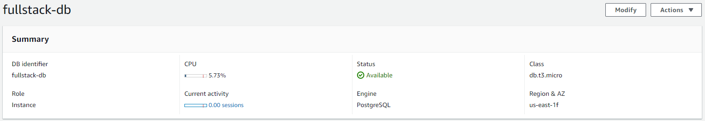
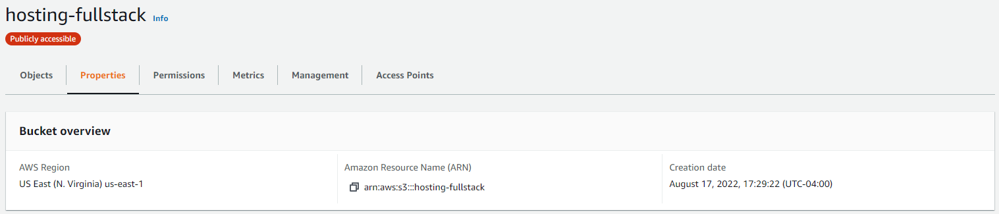
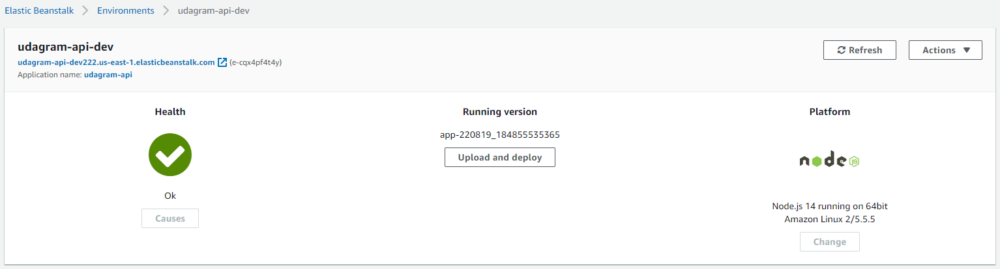
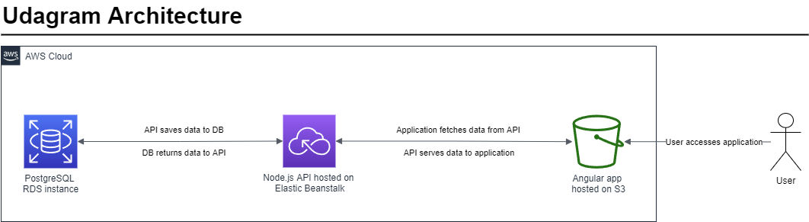

# Application Infrastructure
This documentation explains the infrastructure behind the Udagaram application.

## General Application Components
The Udagram application is made up of the following components:

### Front-End Angular App
An Angular application server's as the application's front-end. This is the only component that the user interacts with directly.

### Back-End Node.js API
Behind the front-end application sits a Node.js API. The front-end application makes calls to this API to send and retrieve data.

### PostgreSQL Database
This database stores user and feed item information. The back-end API interacts with this database to store and retrieve information to be sent to the front-end.

## Amazon Web Services (AWS) Infrastructure
The Udagram application is hosted using AWS resources.

### AWS Relational Database Service (RDS)
The PostreSQL database is provisioned using AWS RDS. It is a publicly accessible1 database hosted in the us-east-1 region.

1 Making a database accessible to the public internet is not ideal but is acceptable in a learning project such as this one.

### AWS Simple Storage Service (S3)
The front-end Angular application is hosted as a static website using AWS S3. The application files are hosted in a publicly accessible storage bucket.

### AWS Elastic Beanstalk (EB)
The back-end Node.js API is hosted using AWS EB. It is a t2.medium sized single instance environment.

## Application Architecture Diagram
Below is a simple architecture diagram containing all of the application's components.

