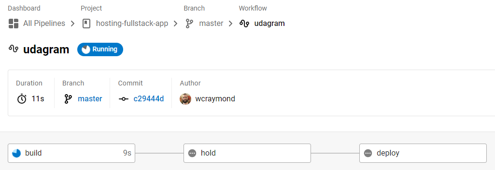
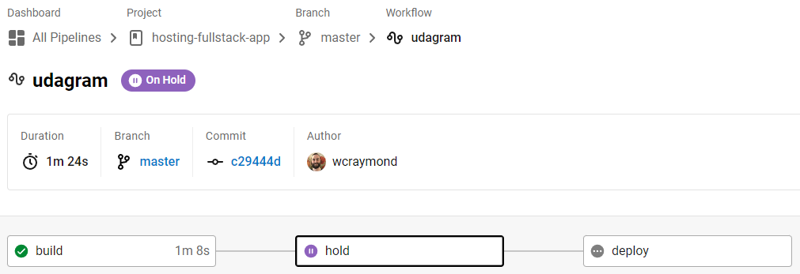
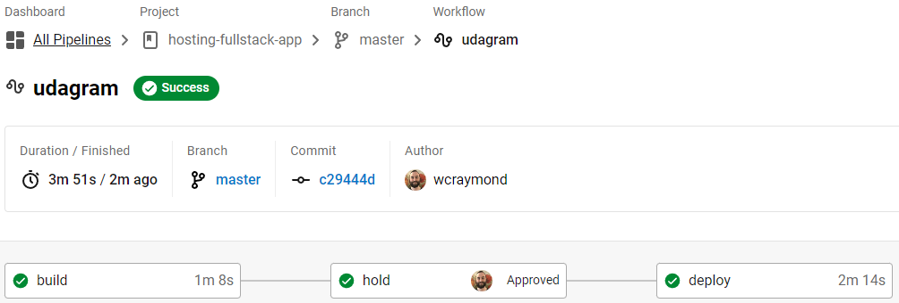
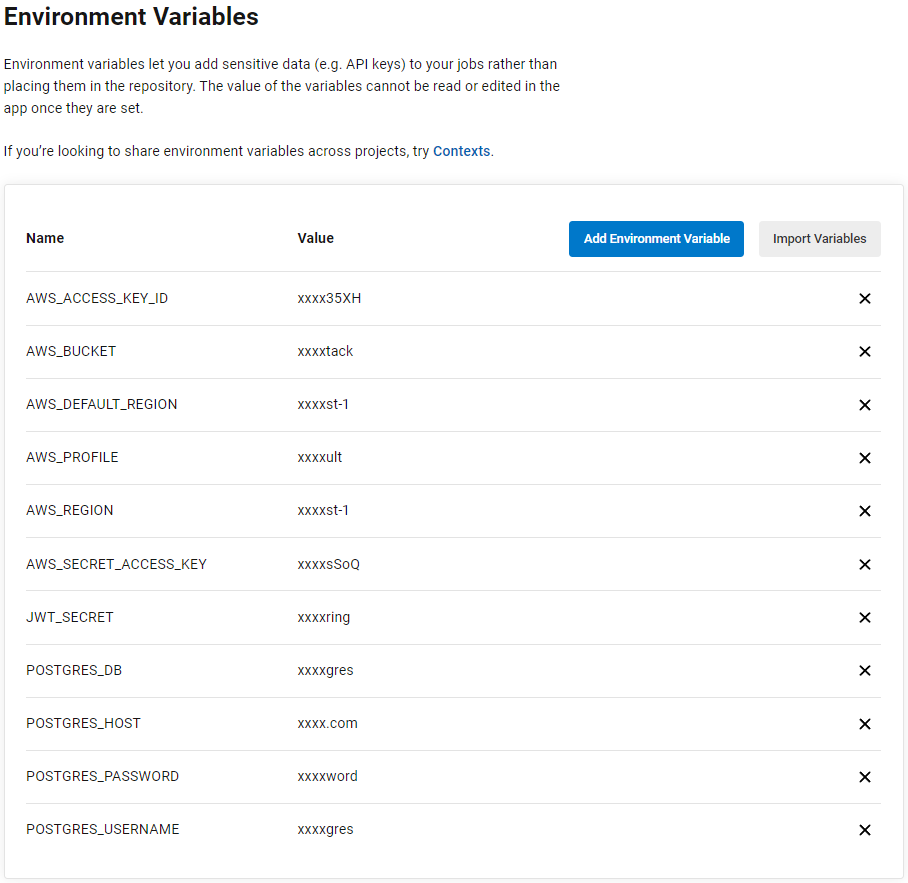
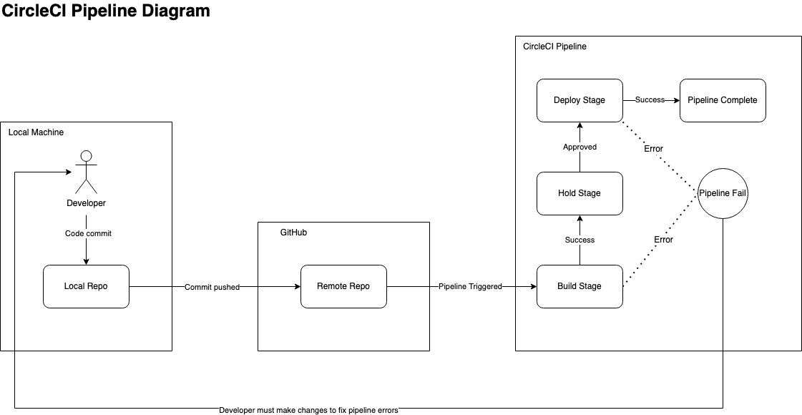

# Pipeline Process
The CircleCI pipeline associated with this project is automatically triggered when a developer pushes code to the master branch in the GitHub repository. This document will explain this process.

## Local Machine
A developer makes changes locally in their master branch1. They commit the code and push it to GitHub.

1 Developers should make their changes in a topic/feature branch in most cases. This project is using a simplified workflow for convenience purposes.

## GitHub
The master branch is updated with the latest commit. Since the GitHub project is linked to the CircleCI pipeline, the pipeline is automatically triggered.

## CircleCI
The pipeline is automatically triggered and begins to run.

### Build Stage 
The pipeline builds the different application components by executing the following steps:

- Install the front-end dependencies
- Install the back-end dependencies
- Lint the front-end application code
- Build the front-end application
- Build the back-end application

### Hold Stage
The pipeline enters a holding stage that requires manual approval before it can proceed with the deployment to AWS.

### Deploy Stage
Deploys the application components to the appropriate AWS resources.

- Front-end code deployed to AWS Simple Storage Service (S3)
- Back-end code deployed to AWS Elastic Beanstalk

Also deploys back-end environment variables to the Elastic Beanstalk environment:

# Pipeline Process Diagram
Below is a diagram of the pipeline process starting with the developer's local commit.

